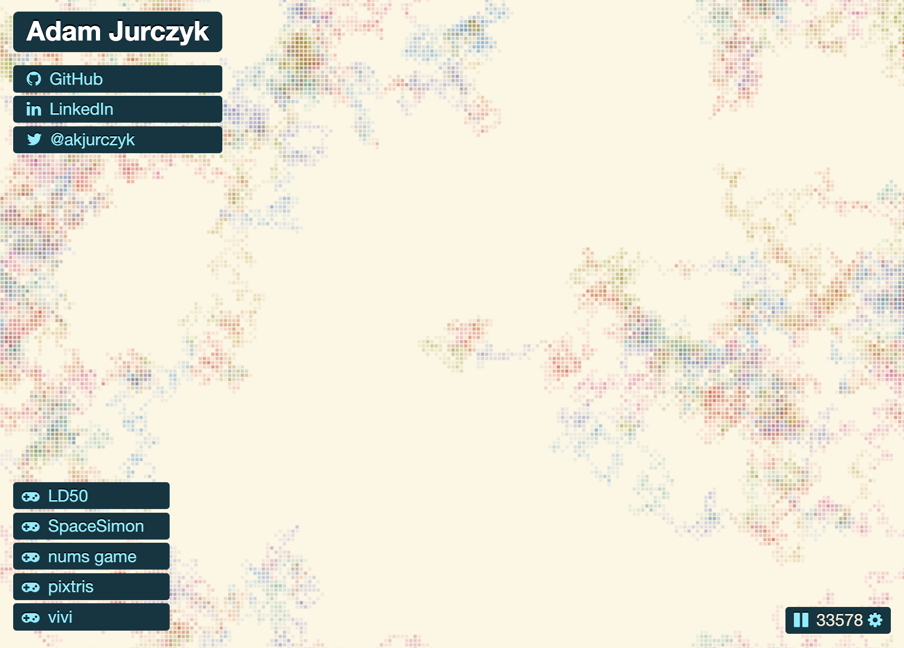

# Starting from structure, not content

I just wanted my own corner of the internet.

My own space (long after [MySpace](https://myspace.com/) has been forgotten) where I can gather what I've already created and share it.

<em lang="pl">Tylko i aż tyle</em>, as we say in Polish - "that's all, and yet it's a lot."

## The old

Truth be told, I already had an old webpage at the same address. But it felt more like one of those big development signs showing a home that hadn't been built yet - just a pretty picture and some contact information. It was _good enough_, so I left it there. The only thing missing was a big yellow "under construction" sign.

I've revisited it from time to time, dusting off cobwebs and adding another link to some new hobby project. Each time, I kept thinking more and more about how limited it was and how much it held me back from expanding.

I was pondering and making plans for something new and better... I just didn't have any real need to actually do it.

## The trigger

Over those years, whenever I had some stuff I wanted to share - hobby projects or creative endeavors - I used various platforms. Whatever felt right, or more alive at the time. And since I wasn't very regular about it, it usually meant a different place each time it happened.

One day, I wanted to show some of my older work, but I couldn't find the link to where I had originally shared it. And once I remembered, I realized I didn't want to send anyone there. Partly because it's an old account, but mostly because [the platform has degraded so much](https://slate.com/technology/2024/05/deviantart-what-happened-ai-decline-lawsuit-stability.html).
After giving it some thought, I also didn't want to just reupload this older stuff to some other service. I don't live off it, so I don't need it to be discoverable or viral. I don't have to put it on social platforms and risk losing the people I send there to algorithms designed to harvest attention.

[^comment]: Link some good references to the last statement.

This is my content, and I want it on my own site.

## The idea

But "something new and better" is not enough to start any project. And even though I love digging into technicalities, I first needed to know _what_ I wanted to build. So I sat down and clarified the core concepts and constraints for this endeavor:

- This is my place, so I want to build it in a way that feels right to me
- A single place for all the things I want to store and share with others
- I want it to be flexible enough to easily expand
- It won't be a portfolio to sell myself, so no work-related content
- Simple to use (for both me and visitors)
- And while I'm at it, let's finally share some of the thought process too - aka, a blog.

It all sounded good, but I encountered one _tiny_ problem.

## The issue

I had no content.

Well, I had some art and a few small coding projects, but that was it. Nothing that felt big enough for a brand-new website. I just don't have much to put here _yet_, especially in written form.

All this time, I really felt like I had nothing to say - not a single thought felt worth adding to this vast ocean of human knowledge and garbage (aka [The Internet](https://youtu.be/k1BneeJTDcU)).

But as I'm getting older, I just don't care about originality. And I still have some stuff I want to put out there. Even if it has no market value, it has worth for me.

And hopefully, building a new place for it would push me to create more, too.

## The new

That, in part, was why I started with _the structure_, designing not only for what I already have, but also what I want to include in the future. I wanted to move past the billboard and build an actual home, even if it starts with just a few chairs and pictures on the walls.

And as a developer, I immediately started with the technical constraints:

- no backend
- no SPA
- no heavy frontend frameworks
- animated main page
- versatile content
- [simple](https://ronjeffries.com/articles/018-01ff/simple-not-easy/) publishing flow

If maintenance or adding content is annoying, I won't do it.

So I've set out to look for tools that would support this kind of workflow, but that's a topic for [another post](../devlog-2).
