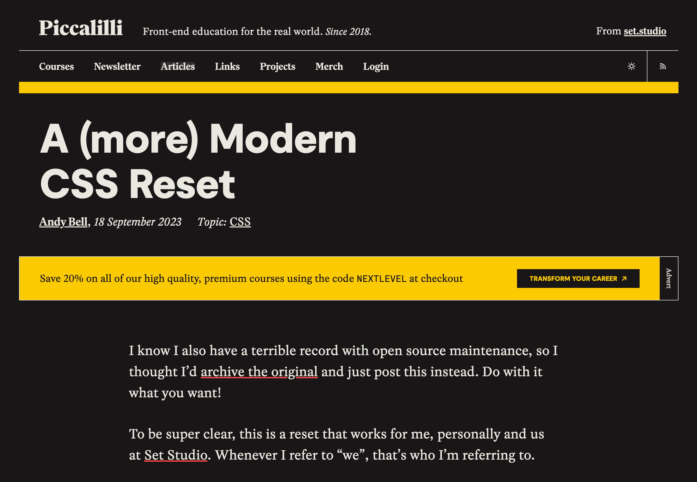

# From prompt to project

[Last time](../devlog-1), I wrote about why I started building a new site, and that was my primary reason. But it wasn't the only reason I finally started it.

There was another factor behind me starting this redesign: generative AI. Yeah, the thing everyone has been talking about for the past few years already. Well, I have my own thoughts about it, but this isn't the time for that. In the context of this site, there were two AI-related aspects for me:

- **The opportunity to learn how to use AI coding assistance** - no matter what our stance is on this, the tool is here to stay in one form or another, and it's better to learn how to use it. And no, this site was not "vibe coded"... at least, most of it wasn't :P
- **Actually finishing the project** - I sometimes have issues with pushing through uninteresting parts and finishing things up, especially in "pet projects." My hope was to get help from AI with getting through those pain points.

And the first part of this was using AI as an alternative to manually searching through current tech.

## Exploration

I've prepared a prompt describing what I wanted to build, more or less something like this:

> Let's discuss a web dev project. I want to create a new personal web page.
> There are a few things I would like to keep, and a few technical aspects I want to consider. But besides that, I'm pretty open and haven't decided on anything specific.
>
> You will help me decide by analyzing what I want and need, asking further clarification questions, and building a project structure plan to use in development.
>
> What I want it to include:
>
> - main page that has basically menu and some basic info.
> - on main page, there will be also some background animations, or something like playground for visual effects, just something visually appealing to toy with
> - as for other pages, I want to have a few sections:
>   - bio - simple text page with some pics
>   - maybe blog of some kind?
>   - Projects catalogue - list of my previous personal projects, possibly with thumbnails.
>   - Art directory - gallery of my hobby artworks, not only graphics, but text and music as well.
> Maybe some contact form? or directions to social media.
>
> I'm not convinced about the design yet, but I'm aiming at something simple, with dark/light mode. It should be responsive, with a single codebase handling multiple device widths.
> 
> Technically, I want to serve the page from GitHub Pages (at least for now), so there won't be any backend at the moment. The page will be located at the same URL as the current one (https://ajur.pl). Subpages should have clear URLs. But most of the projects are on some subdomains, so they will mostly be descriptions with links to project pages.
> I would like the bio and blog parts to be built from Markdown - but with the possibility of adding some JS code directly. Or maybe let it be HTML/JS with Markdown support? Not sure about that, especially since I might want to introduce some more JS-heavy articles/pages.
> So maybe not static pages built from Markdown, but something in between? Maybe something similar to Observable Framework instead of a static site builder like Jekyll? Dunno, I'm open to discussion on this one.
> 
> Key features that this site should have:
> - easy way to add new pages/projects/art - note that easy doesn't mean I need any CDN or stuff; for me, easy could also mean, for example, adding or editing a single text file and committing the change to GitHub to rebuild the page. I just don't want to make multiple file changes to add a blog entry.
> - Parts where I want or need to use JS: it would be best if I could use TypeScript as well - but it's optional.
> - I'm not sure if I want to go with Tailwind for CSS. Maybe something simpler, or plain CSS, would be enough - I don't plan on doing any component-based app

> [!note]- Side note on prompting
> This is a cleaned-up version, as usually when I chat with LLMs, I don't bother with proper English. They're good enough to understand.
> 
> Also, I'm not a prompt expert, and it is possible that it's not optimal. But it worked well enough to get results.
> 
> And one last thing. Although I usually try to use it as a tool and not personify LLMs, it's _really hard_. I start writing like I'm chatting with some assistant, and after a few messages I even tend to thank it for the more useful tips. Those AIs are really cleverly designed in the context of chatting. I kinda understand now why people can get lost in it and treat it like a real friend, or even fall in love.

I've passed the same prompt to both ChatGPT and Gemini. And besides some overall validation, some unnecessary flattery, and a few good pointers, both gave me the same suggestion: use [Astro](https://astro.build/).

> [!question] What about Observable?
> As you could catch in the prompt, I've also considered using [Observable Framework](https://observablehq.com/framework/). Mostly because I've already used Observable notebooks.
> 
> But in the end, it is mostly for data visualisation apps and dashboards, so it wasn't really a fit for my case.


This was an example of how vast the front-end framework space is. And of how detached from it I am - or more like, how hard it is to keep track. Tbh, I had no idea what it was, despite it being a fairly popular static site generator framework. And it was already on version 5 (actually, v6 was released during work on this site). Intrigued, I asked ChatGPT for a breakdown of Astro's features, and soon went directly to their web page and [docs](https://docs.astro.build/en/getting-started/) to learn more.

And I was kinda stunned by how close it was to what I needed. It matched basically every requirement I had, allowed for easy expansion, and provided me with a few great new ideas.

> [!question] Wasn't it AI bias?
> As [Amplifying research](https://amplifying.ai/research/claude-code-picks/report) suggests, it could simply be bias in what the models were tuned on. But even so, it matched my needs so well that I'm not too concerned about it.

## Project setup

I've set up a new project according to Astro's installation instructions, using `npm create astro@latest`. Then I used agentic AI to generate the files for the structure that I had prepared with ChatGPT before. It went pretty smoothly, although I had to go back and make a few changes, e.g. to `content.config.ts`, to make it more like v5 and not v4.

I've added a few test articles, some menu items, placeholder texts here and there, and ended up with a working skeleton that I could expand and "dress" with some styles. Then I moved on to that.

## Design with pure CSS

I was looking for some modern CSS, and among a few proposals there was the [modern reset by Andy Bell](https://bell.bz/a-modern-css-reset/). This reset looked interesting, and I really liked its approach of not removing too much. But it was a bit old, and as suggested in the article, I went to check the [updated version](https://piccalil.li/blog/a-more-modern-css-reset/).

And the reset was great, and I'm using it, but it's not the main thing I got from it. When I opened the page for the new version on the [Piccalilli](https://piccalil.li/) site, I was stunned. The whole design of the site was top-notch. Bold and minimal at the same time. I was really digging it.



So I've started to investigate. I've checked more of their articles, and more content by Andy. It was a great source of learning and inspiration. Through that, I've found out about [Cube CSS](https://cube.fyi/) and [Every Layout](https://every-layout.dev/) - both made a lot of sense, and I used whatever I could from them.

The things I especially picked up, which I would not have considered before, were dynamic font scaling and exponential spacing:

```css
--calculated-font-size: calc(1rem + 0.6vw);

--s-2: calc(pow(var(--spacing-ratio), -2) * var(--s0));
--s-1: calc(pow(var(--spacing-ratio), -1) * var(--s0));
--s0: 1rem;
--s1: calc(pow(var(--spacing-ratio), 1) * var(--s0));
--s2: calc(pow(var(--spacing-ratio), 2) * var(--s0));
```

In the end, I've spent quite a lot of time researching and learning a modern approach to CSS. And although I don't think what I ended up with is in any way perfect or exactly as it should be, it's fairly clean, without any bloated library or unnecessary preprocessor.

The single downside was that most generated code was very "reacty" and "tailwindy", so I had to step in a lot with handcrafted code to actually get it written the way I wanted.

Nonetheless, this was a pretty good start. And as I had a pretty specific idea for the landing page, I went to [make that next](../devlog-3).