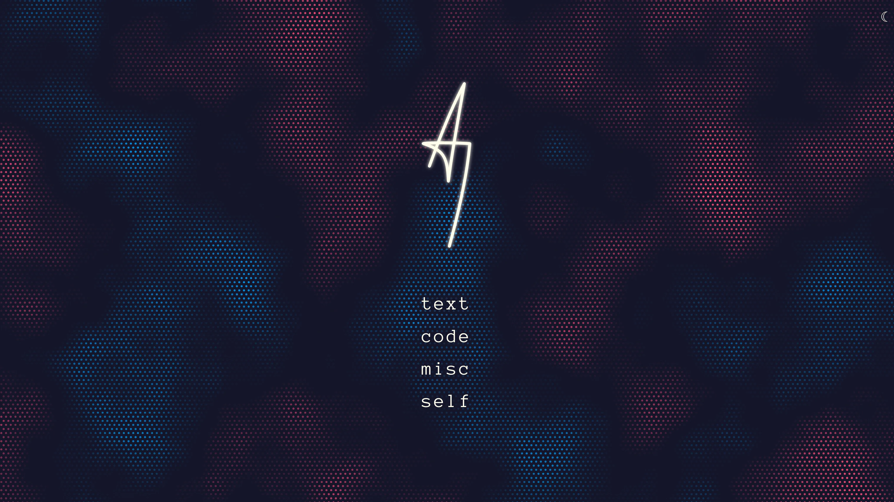

# Landing page fun

After [creating the basic project structure](../devlog-2/), I moved straight to the landing page to get that initial "this is fun" boost.

The old page felt like mine: bare, minimal, and built around a single strong visual element. I wanted to preserve that feeling. And that was okay, because if I consider my old home page just a facade, then this whole new web page would be like building an actual home with rooms behind it.

## Animation

So, background animation was a must. And although I liked my old random walk, this time I wanted a more subtle, noise-based animation. Somewhat inspired by [Nature of Code exercises](/projects/nature-of-code/).

Another idea was to have the home page be a sort of visualisation runner, with an option to change between different animations (I kinda ditched the idea for now). Thus I needed some kind of animation runner to swap between different animations, supporting both simpler 2D canvas and shader-based 3D canvas.

As I didn't want to use any additional library, and I'm not that familiar with WebGL, I've basically vibe-coded the whole thing (well, maybe aside from [GLSL simplex noise](https://github.com/stegu/psrdnoise/)). Yes, from the animation manager, through the shader runner, to the shader animation itself. I had a pretty strong idea of how it should work and look, and I prompted through it without many manual changes to the generated code.

> [!note] Vibe-coding
> I’m not proud of it, and I did lose the chance to learn more GLSL. But I only have so much free time, and this approach let me finish it without disappearing into another study rabbit hole.

## Main menu struggles

What was left was the menu and the general UI layout. In contrast to the old layout, I wanted to make it central, not some corner-stuck afterthought. On the other hand, I didn't want to make it all-containing like some kind of news portal. So no _latest article_ or similar stuff.

With some fiddling, I landed on a centered logo, a simple main menu, and a theme switch icon in the corner.

As a logo, I've used my initials that I had already used as an animated loading screen for a few projects. It is simple, clean, and works well with switched colors. Done.

The menu layout was simple: a centered column of links. Clear, visible, and functional. It just didn't look as good as I hoped.

From the start I had 4 main content types in mind, and that was reflected in pretty standard names for the subpages (and as of writing this, those are still in the links): `articles, projects, art, about`. But when I prepared the front page's vertical menu, it felt off. It was just too uneven and somewhat unappealing. Too generic and not fitting the design.

I tried a few things, couldn't land on anything, so I turned to my recent ["rubber duck"](https://en.wikipedia.org/wiki/Rubber_duck_debugging) - AI chat. I asked for alternatives, and one idea clicked: `articles` became `text` and `projects` became `code`. That looked much better, and gave _source code_-like vibes. To align with this 4-letter word constraint, I changed `about` to `self`.

> [!question] Why not `this`
> As most programmers would notice, `this` seemed like an obvious pick if I wanted to keep the programming vibes. Being a keyword in most languages, that would be perfect... but for some reason, it didn't feel right. Almost like it would suggest that the page was more about itself than about me.
> As a result, I decided to go with `self`, which is the conventional ([but not forced](https://realpython.com/ref/glossary/self/)) equivalent of `this` in [Python](https://www.python.org/).

The last one was `art`, which I couldn't compress into any 4-letter word that still felt right. It was meant to hold a gallery of sorts, with different creative works I fiddle with in my free time. Mostly drawings, but also some writing, maybe music or photos. But no word was good enough to wrap it all up. While going back and forth on it, I got pretty much roasted:

> **You’re over-optimizing structure early** - You spent a lot of time on content schema, naming and pipelines, before having real content volume.

Ouch! That was spot on, and it hit hard (well, that plus a few other points).

Initially, I felt like ChatGPT was mocking me for not choosing any of the words it suggested, but after that one line, I understood the issue it had... or more like, the issue **I had**. The whole thing was pretty significant and insightful enough that it led to rethinking [why I'm doing this redesign](../devlog-1/).

In the end, I had to do something with this menu entry, and I stayed with `misc`, putting the art gallery as its subpage. It's commonly used by programmers, vague enough to fit the uncertainty of that section, and practical enough to let me _move on_.

## Final landing page

Here it was, the final result (in case future me decides to change it again):

Now, with the main page in a satisfactory state, it was time to add actual [content pages](../devlog-4).