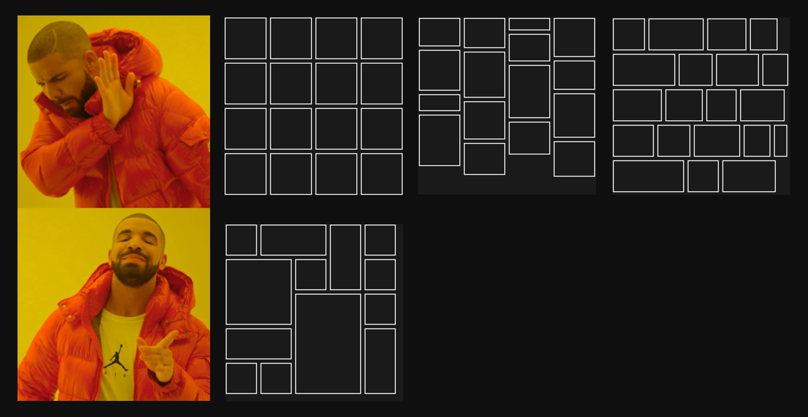
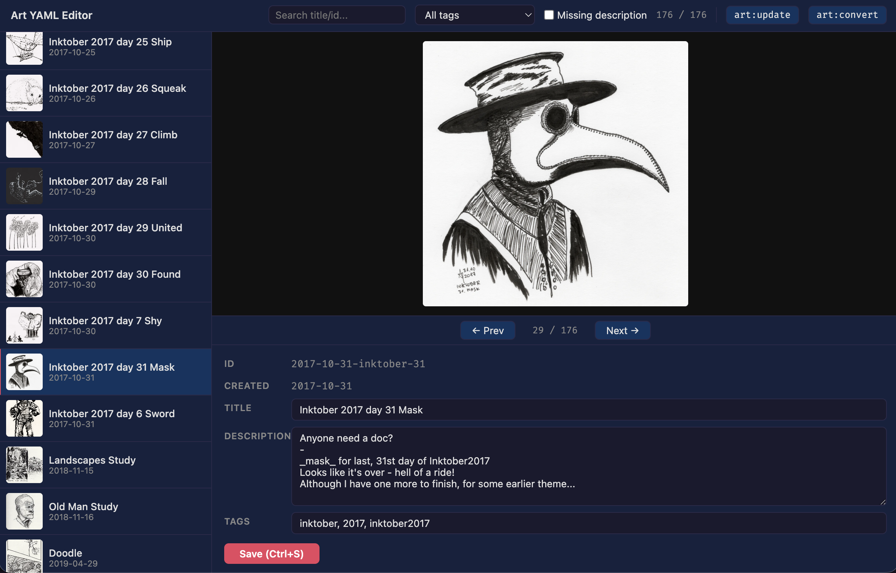

# Processing gallery images for hosting

As I've got hold of a better scanner recently, I've taken the opportunity to scan my old artwork at a higher resolution. So I've scanned all of it as 1200dpi TIFF images. And for 100+ images, usually around A5 size, that's _a lot_ of data.

## Scanned images are just too big

Placing 50-500 MB images on the web is rarely a good idea. So there were two obvious things to do: use a different image format and scale them down.

Looking for a target image format, as much as I wanted to go with [JPEG XL](https://en.wikipedia.org/wiki/JPEG_XL), its support is still not good enough. So I went with the now-common [WebP](https://en.wikipedia.org/wiki/WebP), with lossy compression at 82% - that was giving good enough web quality with nice compression rates.

As for dimensions, however you look at it, 1200dpi is more like archival quality. Even 600dpi is big enough. So for those high dpi scans I simply scaled them down by half:

```ts
execSync(`magick "${mainTif}" -filter LanczosSharp -distort Resize 50% -quality ${WEBP_QUALITY} "${fullPath}"`);
```

I didn't scale them down further, mostly for simpler support of high-density screens. I also forced scaling down even for small images, as I wanted them displayed in a somewhat original size, or at least with proper relative sizes between them (not sure if I achieved that tbh).

As for other source images, I'm just ensuring that the longest edge doesn't exceed 3500px; otherwise, only compression is applied.
```ts
if (maxDim > FULL_RESAMPLE_DIM) {
    const pct = ((FULL_RESAMPLE_DIM / maxDim) * 100).toFixed(2);
    execSync(`magick "${mainTif}" -filter LanczosSharp -distort Resize ${pct}% -quality ${WEBP_QUALITY} "${fullPath}"`);
} else {
    execSync(`magick "${mainTif}" -quality ${WEBP_QUALITY} "${fullPath}"`);
}
```

And that's the gist of preparing _master_ images - i.e. those that are shown in a "lightbox" popup. But those were not enough to show a proper gallery wall.

## Enforcing thumbnail aspect ratio

My idea for the gallery page from the beginning was to have a nice wall of pics, in the style of other similar pages, but I hated the idea of fitting everything into squares like [some other page does](https://www.instagram.com/), and I didn't like fixed-size [columns](https://pinterest.com/) or [rows](https://www.deviantart.com/) of typical masonry layouts. So I went with fitting everything into a fixed-size grid, but with a way to tell images how many rows and cols to take, and fill it to the top.



That gave a great effect without forcing everything into portrait/landscape buckets, and it let me highlight pieces I'm especially proud of. The downside was giving up strict chronological order - as some pieces had 'flown up' to fill empty spaces - but that was something I could live with.

For images that had simple ratios, like 1:1, 1:2, 3:1, 2:3, 3:4 etc., the only thing needed to prepare thumbnails was to rescale the master image to target thumbnail sizes. The remaining issue was non-standard images. For those, I went with the simple route of creating a _master-thumb_ image that basically was the original _master_ image, manually cropped to the desired aspect ratio. An additional gain of that approach was an easy way to "degrade" a 2:3 or 4:3 image that I wasn't as proud of to just a 1:1 thumbnail.

What was left was to create content descriptions for Astro.

## Two pass content addition

For the Astro content collection, I wanted to avoid creating a separate `.md` file for each image, especially as it contains only metadata. So I went with a single `art.yaml` collection.

To fill it, I created two scripts (read: by prompting AI, ofc with a **properly detailed specification** ;P), for a two-pass content update:

#### `art-update.ts`

First is the content update script. It loads `art.yaml` to have the current state, then it reads directories with master images to find all new files. And for each new file, it adds a new entry with some of the metadata prefilled, most notably: `id, date, main tag, title, thumbnailRatio`.

The first four are extracted from the image name. It also enforces a naming convention:
```
yyyy-(mm)?-(dd)?-main_tag-title(_thumb)?.webp
```
It's pretty strict, but good for archiving. It also provides a way to recognize `master` and `master_thumb` as a single content entry.

Note that there is no image conversion at this point yet! And that's because I want to give myself the possibility to modify the thumbnail aspect ratio, e.g. promoting (enlarging) a `1:1` thumbnail to take `2:2` cells.

#### `art-convert.ts`

When I have updated (and possibly modified) the content metadata, there is a second-pass script that reads `art.yaml` and checks each content item's `images` and `thumbnails` to see what it has, whether the files exist, and creates proper conversions if any of the expected files are missing.

And although it does a lot, there is not much to tell about it.

## Make life easier with custom editor

Once the number of images hit a certain value, editing thumbnail ratios by hand, or adding tags and descriptions, started to be painful. Both because of the size of the file, and because of going back and forth to verify which image actually had a given name.

So, I vibed a simple dev-only, Node-based editor that would list all entries of `art.yaml` and allow editing them with a preview.



As a bonus, I've added support for _mini markdown_ in the image descriptions - basically enabling 3 things:
- replace newlines with `<br>`
- support basic link format `[like](this)`
- support basic styling, currently only `_underscores_` converted to `<em>`

## rclone it all

Even converted and optimized, the images take up quite a lot of disk space, and usually it's not a good idea to keep them all in a git repo.

After looking for some (cheap) options, I went with [Cloudflare R2](https://www.cloudflare.com/products/r2/) storage - as it's cheap for static content, and has enough space in free tier for my use case.

And as it supports [S3](https://aws.amazon.com/s3/) API, I can just [rclone](https://rclone.org/) it all into my bucket.

And that's it, my not-so-simple, yet manageable enough flow for adding images to [gallery](/misc/art).
